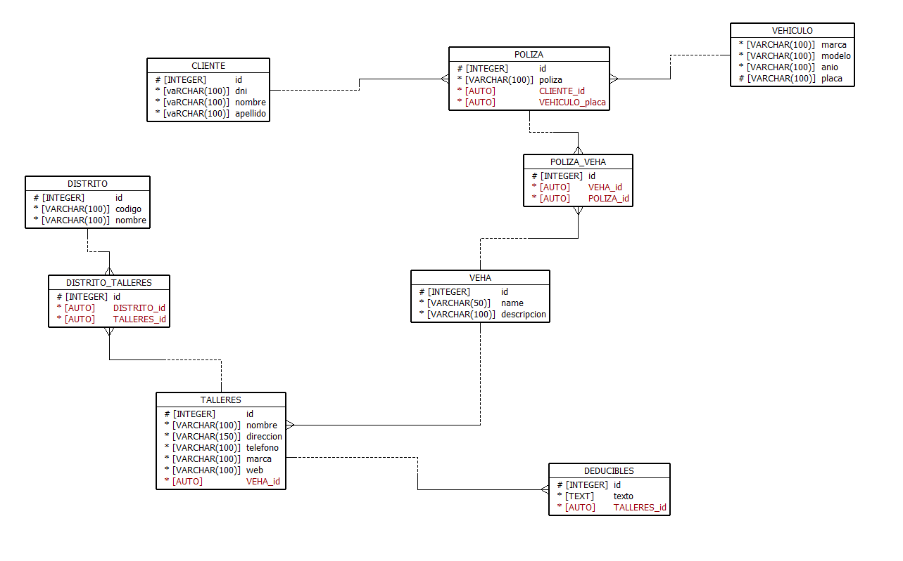

# reto Rimac

This project contains source code and supporting files for a serverless application that you can deploy with the SAM CLI. It includes the following files and folders.
El proyecto contiene el codigo y los archivos para la aplicacion serverless, el core del negocio es la busqueda de talleres dependiendo de la placa del vehiculo, distrito y el tipo de taller.
# Diagrama de base de datos


## Despliegue de la aplicacion 
La interfaz de línea de comandos del modelo de aplicación sin servidor (CLI de SAM) es una extensión de la CLI de AWS que agrega funcionalidad para crear y probar aplicaciones Lambda. Utiliza Docker para ejecutar sus funciones en un entorno de Amazon Linux que coincide con Lambda. También puede emular el entorno de compilación y la API de su aplicación.

* SAM CLI - [Install the SAM CLI](https://docs.aws.amazon.com/serverless-application-model/latest/developerguide/serverless-sam-cli-install.html)
* [Python 3 installed](https://www.python.org/downloads/)
* Docker - [Install Docker community edition](https://hub.docker.com/search/?type=edition&offering=community)

Para compilar e implementar su aplicación por primera vez, ejecute lo siguiente en su shell:

```bash
sam build --use-container
sam deploy --guided
```
## Para compilar el proyecto en local

Cree su aplicación con el comando `sam modulo perfil-aws stage`.

```bash
$ sam build --use-container
```

The SAM CLI installs dependencies defined in `hello_world/requirements.txt`, creates a deployment package, and saves it in the `.aws-sam/build` folder.

Test a single function by invoking it directly with a test event. An event is a JSON document that represents the input that the function receives from the event source. Test events are included in the `events` folder in this project.

Run functions locally and invoke them with the `sam local invoke` command.

```bash
$ sam local invoke HelloWorldFunction --event events/event.json
```

The SAM CLI can also emulate your application's API. Use the `sam local start-api` to run the API locally on port 3000.

```bash
$ sam local start-api
$ curl http://localhost:3000/
```

The SAM CLI reads the application template to determine the API's routes and the functions that they invoke. The `Events` property on each function's definition includes the route and method for each path.

```yaml
      Events:
        HelloWorld:
          Type: Api
          Properties:
            Path: /hello
            Method: get
```

## Add a resource to your application
The application template uses AWS Serverless Application Model (AWS SAM) to define application resources. AWS SAM is an extension of AWS CloudFormation with a simpler syntax for configuring common serverless application resources such as functions, triggers, and APIs. For resources not included in [the SAM specification](https://github.com/awslabs/serverless-application-model/blob/master/versions/2016-10-31.md), you can use standard [AWS CloudFormation](https://docs.aws.amazon.com/AWSCloudFormation/latest/UserGuide/aws-template-resource-type-ref.html) resource types.

## Fetch, tail, and filter Lambda function logs

To simplify troubleshooting, SAM CLI has a command called `sam logs`. `sam logs` lets you fetch logs generated by your deployed Lambda function from the command line. In addition to printing the logs on the terminal, this command has several nifty features to help you quickly find the bug.

`NOTE`: This command works for all AWS Lambda functions; not just the ones you deploy using SAM.

```bash
$ sam logs -n HelloWorldFunction --stack-name  --tail
```

You can find more information and examples about filtering Lambda function logs in the [SAM CLI Documentation](https://docs.aws.amazon.com/serverless-application-model/latest/developerguide/serverless-sam-cli-logging.html).

## Tests

Tests are defined in the `tests` folder in this project. Use PIP to install the test dependencies and run tests.

```bash
$ pip install -r tests/requirements.txt --user
# unit test
$ python -m pytest tests/unit -v
# integration test, requiring deploying the stack first.
# Create the env variable AWS_SAM_STACK_NAME with the name of the stack we are testing
$ AWS_SAM_STACK_NAME=<stack-name> python -m pytest tests/integration -v
```

## Cleanup

To delete the sample application that you created, use the AWS CLI. Assuming you used your project name for the stack name, you can run the following:

```bash
aws cloudformation delete-stack --stack-name 
```

## Resources

See the [AWS SAM developer guide](https://docs.aws.amazon.com/serverless-application-model/latest/developerguide/what-is-sam.html) for an introduction to SAM specification, the SAM CLI, and serverless application concepts.

Next, you can use AWS Serverless Application Repository to deploy ready to use Apps that go beyond hello world samples and learn how authors developed their applications: [AWS Serverless Application Repository main page](https://aws.amazon.com/serverless/serverlessrepo/)


# comandos sam
## build 
- sam build

## local
- sam local invoke "nombre de la funcion"

## local api

- sh .\sls.sh user reto local

## deploy
- sam deploy --guided
# delete cloudformation 
- aws cloudformation delete-stack --stack-name formula-prueba --region us-east-1 --profile elias
### sam deploy
sam build; sam deploy --no-confirm-changeset ; [System.Media.SystemSounds]::Asterisk.Play()

## config environmet
* .env.local
## library
- para poder desplegar en la nube la libreria
    * pip install pymysql -t .
    * pip isntall http_status -t dependencies/python

##
- fix error autorizers https://github.com/aws/aws-cdk/issues/723#issuecomment-504753280

## comando deploy
- sh .\sls.sh user reto prd